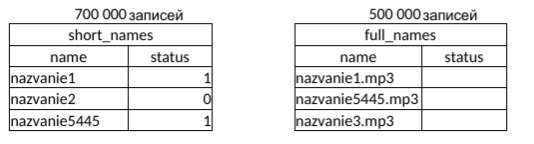

# Тестовое задание на доложность Python разработчика 
Необходимо выполнить оба задания, результат необходимо представить в github 
Решение второго задания необходимо приложить в readme в репозитории.
Решение завернутое в докер и приложенный скрипт значительно повышает шансы
на one day offer.
## 1. Вопрос практический. 
Решение завернутое в докер будет преимуществом. Также в
зачет идут любые толковые комментарии и интерпретации хэндлеров относительно
реализации этого сервиса. Необходимо разработать RESTful сервис с 
использованием FastAPI и Redis.
### Эндпоинты (handlers)
* *Добавлено для проверки бд*
```python
/ping  # Проверка подключения к бд. Возращает status: pong
       # msg: The database is connected
```
* Визуализация и взаимодействие с API через Swagger UI
```python
/api/swagger-ui
```
* Запись и обновление данных

```python 
/write_data
```

1. Phone
2. Address

* Получение данных

```python
/check_data
``` 
1. Phone

### Сценарии использования сервиса:
1. Клиент отправляет запрос на хэндлер вида 
https://111.111.111.111/check_data?phone='89090000000'
Эндпоинт в свою очередь получает номер телефона и идёт в
redis по ключу (номер телефона) получает сохраненный адрес и отдаёт его в ответе
клиенту.
2. Клиент отправляет запрос на хэндлер для записи данных в redis вида
https://111.111.111.111/write_data c телом
phone:'89090000000'
address:'текстовый адрес’
3. Клиент отправляет запрос на хэндлер изменения адреса вида
https://111.111.111.111/write_data c телом
phone:'89090000000'
address:'текстовый адрес’

### HTTPS
Для отправки запросов по https был сгенерирован self signed сертификат
Для доступа по https необходимо добавить сертификат в директорию сертификатов
## 2. Дано две таблицы в СУБД Postgres 


```sql
CREATE TABLE IF NOT EXISTS public.short_names (name varchar, status varchar);

INSERT  INTO short_names (name, status)
SELECT concat_ws('', 'nazvanie', i) AS name,
(SELECT * FROM generate_series(0,1) ORDER BY random() LIMIT 1) AS status
FROM generate_series(1, 700000) s(i);
```

```sql
CREATE TABLE IF NOT EXISTS public.full_names (name varchar, status varchar);

INSERT  INTO full_names (name)
SELECT concat_ws('', 'nazvanie', random_bettween(1, 500000), 'mp3') AS name
FROM generate_series(1, 500000) s(i);
```
